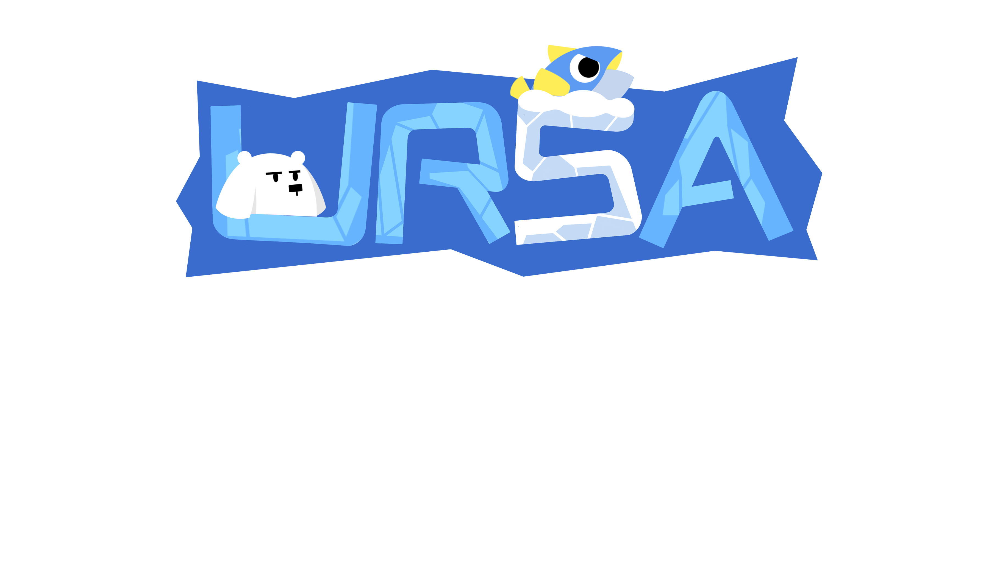

<h1 align="center" style="color: #26428b;">
   
  
   
  Ursa
   
</h1>

<h4 align="center" style="margin-bottom: 5px;"> Dylan Kenniff | Yusuf Khadir | William Leung | Athena Lin   Zekai Lin | Daniel Parker | Rigel Wafford </h4>

## Concept Statement

Amidst the mother bear Ursa’s tireless hunt to feed her cubs, a sinister plot ripples beneath the surface. The salmon army, driven by desperation, has evolved legs and kidnapped the cubs, casting an ominous shadow on the serene snows above. Now, players must guide Ursa on a perilous journey through treacherous terrain teeming with vengeful salmon to rescue her children. 

Fortunately, players have a couple tools at their disposal to help them brave the wilderness. Ursa’s bright white fur camouflages her with the sunlit landscape but betrays her when in shadow. Thus, as night approaches, players become more vulnerable to enemies and must seek out caves where they can rest away the night. In addition, players can push over trees to distract guards and shorten shadow lengths.

## How to Play
* Use the **Arrow Keys** to move around the map 
* Press **F** when close to trees to shake them, dropping snow on and confusing enemies close by 

## How To Download
You can download the latest version of our game by going to <a href="https://github.com/William-Leung/ursa/releases">Releases</a> and downloading _prototype.zip._

## Acknowledgements

This game is the final project for Cornell's CS 3152: Intro to Game Development. 

Thus, it would not be possible without the instruction of Professor Walker White and Professor Traci Nathans-Kelly. In addition, the amazing course staff, particularly Zhiyuan Chen, Benjamin Neuwirth, Jenny Zhang, and Ariela Gettig, have been instrumental in guiding the development of this project :)

## License

Cornell owns a non-exclusive license to this property and has the right to distribute the game (as of Showcase) for promotional and non-commercial purposes. 